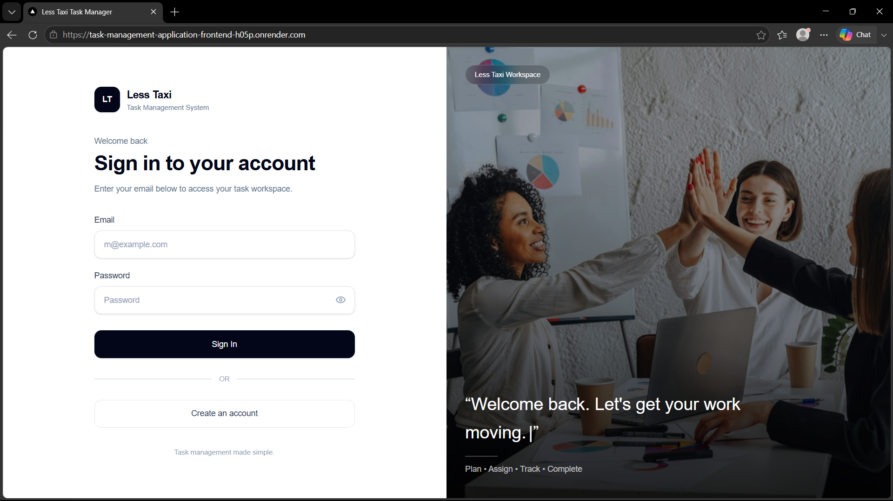
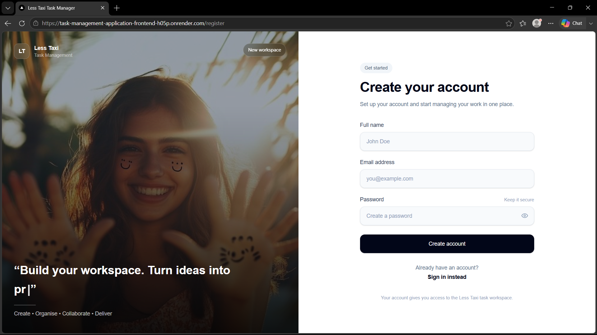
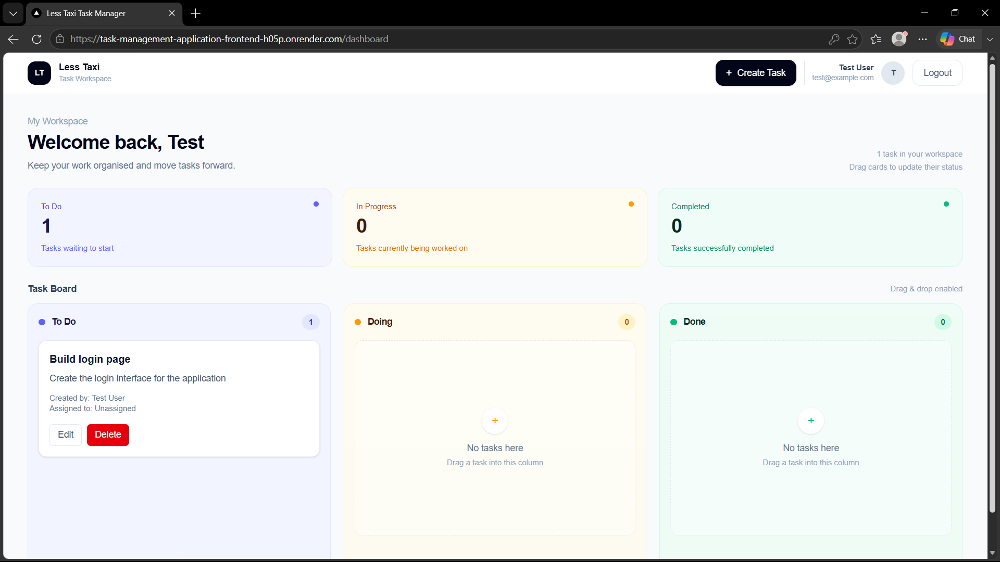
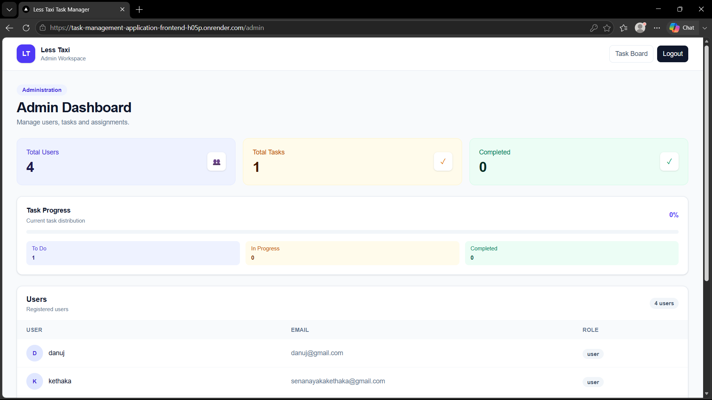

# Less Taxi Task Management Application

A full-stack Trello-like task management application developed for the **Less Taxi Software Engineer Intern Technical Assignment**.

The application provides authenticated task management with separate user and administrator capabilities, a three-column drag-and-drop task board, and persistent task status updates through a REST API and MongoDB database.

## Features

* User registration and login
* Role-based access control for User and Admin roles
* Password hashing and JWT-based authentication
* Task creation and management
* Task assignment and reassignment
* Three task statuses: To Do, Doing, and Done
* Drag-and-drop task movement between status columns
* Persistent task status changes in MongoDB
* Separate frontend and backend projects
* RESTful backend APIs
* Responsive user and administrator dashboards

## Technology Stack

### Frontend

* Next.js
* React
* TypeScript
* Tailwind CSS
* Axios
* dnd-kit

### Backend

* Node.js
* Express.js
* MongoDB
* Mongoose
* JSON Web Token (JWT)
* bcryptjs
* CORS
* dotenv

## Pro+ject Structure

```text
Task-Management-Application/
│
├── backend/
│   ├── middleware/
│   ├── models/
│   ├── routes/
│   ├── scripts/
│   ├── package.json
│   └── server.js
│
├── frontend/
│   ├── app/
│   ├── components/
│   ├── services/
│   ├── public/
│   ├── package.json
│   └── next.config.ts
│
└── README.md
```

## User Roles

### Normal User

Normal users can:

* Register an account
* Log in
* Create tasks
* Assign eligible unassigned tasks to themselves
* Manage their own tasks
* Move tasks between To Do, Doing, and Done

### Administrator

Administrators have elevated privileges and can:

* View users across the system
* View all tasks
* Manage task assignments
* Reassign tasks between users
* Manage tasks across the application

Administrator accounts are created through the database seed script rather than through public registration.

## Task Management

Each task contains:

* Title
* Description
* Status
* Creator
* Assigned user
* Created timestamp
* Updated timestamp

The available task statuses are:

```text
To Do
Doing
Done
```

## Drag-and-Drop Board

The application provides a Trello-style task board with three status columns.

Users can drag task cards between the columns to update their status. Status changes are sent to the backend and persisted in MongoDB, allowing the updated state to remain after refreshing the application.

## Backend API

The Express.js backend provides RESTful API route groups for:

```text
/api/auth
/api/users
/api/admin
/api/tasks
```

These routes handle:

* User registration
* Authentication
* User operations
* Administrator operations
* Task creation and management
* Task assignments
* Task status updates

## Environment Variables

Create a `.env` file inside the `backend` directory:

```env
MONGODB_URI=your_mongodb_connection_string
JWT_SECRET=your_secure_jwt_secret
PORT=5000
```

Sensitive credentials and environment variables should not be committed to the repository.

## Local Setup

### 1. Clone the Repository

```bash
git clone https://github.com/Danuj-kethaka/Task-Management-Application.git
```

Navigate into the project:

```bash
cd Task-Management-Application
```

### 2. Backend Setup

Navigate to the backend:

```bash
cd backend
```

Install dependencies:

```bash
npm install
```

Create the `.env` file and configure the required environment variables.

Start the backend development server:

```bash
npm run dev
```

The backend runs on:

```text
http://localhost:5000
```

### 3. Create the Administrator

From the `backend` directory, run:

```bash
npm run seed:admin
```

This creates the administrator account through the database seed script.

### 4. Frontend Setup

Open a new terminal and navigate to the frontend:

```bash
cd Task-Management-Application/frontend
```

Install dependencies:

```bash
npm install
```

Start the frontend development server:

```bash
npm run dev
```

The frontend runs on:

```text
http://localhost:3000
```

## Running the Application

The frontend and backend should be running simultaneously.

### Backend

```bash
cd backend
npm run dev
```

### Frontend

```bash
cd frontend
npm run dev
```

Then open the application in a browser:

```text
http://localhost:3000
```

## Authentication and Authorization

The application implements secure authentication using JSON Web Tokens.

The authentication flow includes:

1. Users register through the frontend.
2. Passwords are securely hashed before being stored.
3. Users log in using their credentials.
4. The backend generates a JWT after successful authentication.
5. Protected API requests require a valid authentication token.
6. Users are redirected according to their assigned role.
7. Backend authorization controls access to protected functionality.

Role-based authorization is enforced on the backend rather than relying only on frontend restrictions.

## Security

The application includes:

* Password hashing using bcryptjs
* JWT-based authentication
* Protected API routes
* Role-based authorization
* Environment variables for sensitive configuration
* Administrator creation through a seed script
* MongoDB-based persistent data storage

## Database

MongoDB is used as the application's persistent database, with Mongoose providing schema definitions and database interaction.

### User

User records contain:

* Name
* Email
* Password
* Role
* Created timestamp
* Updated timestamp

### Task

Task records contain:

* Title
* Description
* Status
* Creator
* Assigned user
* Created timestamp
* Updated timestamp

Tasks and users are related through MongoDB object references.

## Deployment

The application is deployed using **Render**, with the frontend and backend hosted as separate services.

### Frontend

The Next.js frontend is deployed on Render and is available at:

**Frontend URL:**
https://task-management-application-frontend-h05p.onrender.com

### Backend

The Express.js backend is deployed on Render and is available at:

**Backend URL:**
https://task-management-application-mu0k.onrender.com

The deployed frontend communicates with the deployed backend through the REST API.

Production environment variables are configured securely through the Render environment settings and are not committed to the repository.

## Administrator Credentials

The administrator account is created through the database seed script and can be used to access the administrator dashboard.

**Email:**
admin@lesstaxi.com

**Password:**
Admin@12345


## Screenshots

### Login


### Registration


### User Dashboard


### Admin Dashboard


## Repository

**GitHub Repository:**

https://github.com/Danuj-kethaka/Task-Management-Application

## Assignment

This application was developed as part of the **Less Taxi Software Engineer Intern Technical Assignment**.

The project demonstrates:

* Full-stack web development
* RESTful API development
* Authentication and authorization
* Role-based access control
* Database design and persistence
* Task management
* Drag-and-drop functionality
* Frontend and backend separation
* Deployment and application documentation

## Author

**Danuj Kethaka**
